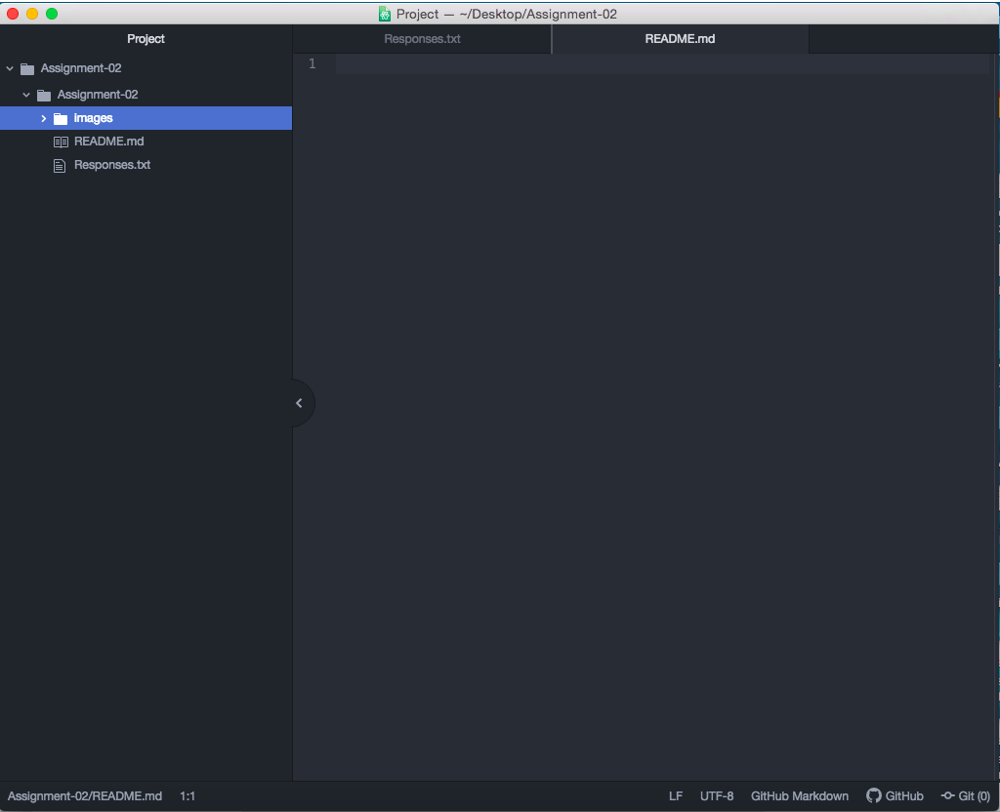

# Assignment-02
## Alexander Thurner

I took this class (Introduction to Web Design) because I was interested on how to create a website and using coding. I have made a website for my dad's company last summer but I wanted to gain skills in Wordpress & HTML to advance my learning of new software. I thought this class would be beneifcal to me in gaining those skills and learning how to create a more efficient website. Lastly, I needed 3 more upper-divison credits to fully graduate so I thought this class was more interesting than some other classes offered for the summer 2020. 

A list of things in markdown:

- I have learned how the internet works.
- I have learned how the web is different from the internet.
- I have learned how data travels through the internet.

1. I hope to learn more about wordpress and how to use the tools for it.
2. I hope to learn how to use coding in creating the website.
3. I hope to learn more about HTML & other programming languages.

[Google Search](https://www.google.com/)

[My Responses File](./Responses.txt)

