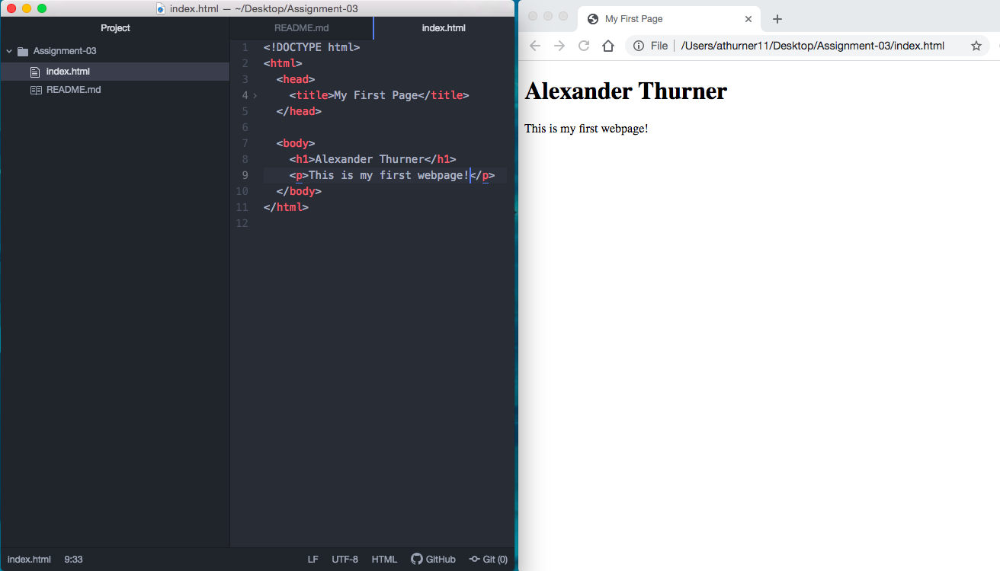

The primary function of a web-browser uses a user-interface that contains a address bar, back & forth button, & tabs. THe rendering engine that is responsible for HTML(art-content) & CSS (style content) displays. The browser engine then directs action from the user face to the rendering engine with communication with service. To receieve content, the browser has to commmunicate over the network asking for images & documents that make up the page. If we provide interactive logic & functionality to the website you would need to use a programming language called javascript. 

Java script and a browser have different types of languages so a javascript interpreter is used for translating communication from javascript to the browser. Each browser has its own individual javascript interpreter. Data storage uses cookies & a local storage to help retain information after refreshing the page. Cookies is used to remember bits of information such as your name (ID Card). Three browsers I use to surf are Google Crom (v8), Safari, & Firefox (Spider Monkey).

Markup language is a computer language that dictates structure of pages and it's text content of a document. One commonly used markup language is hyper text mark up language (HTML). HTML determines the structure of pages content and could be attached to pages such as style sheets & scripts. It is the most common widely used language with a standarized element of a tagging system that is used to bender content & page structures. A downside of HTML is that requires consistent version changes & updates but sometimes those updates need extended education. Lastly, the quality varies which does not always work across web-browsers & other devices. 

