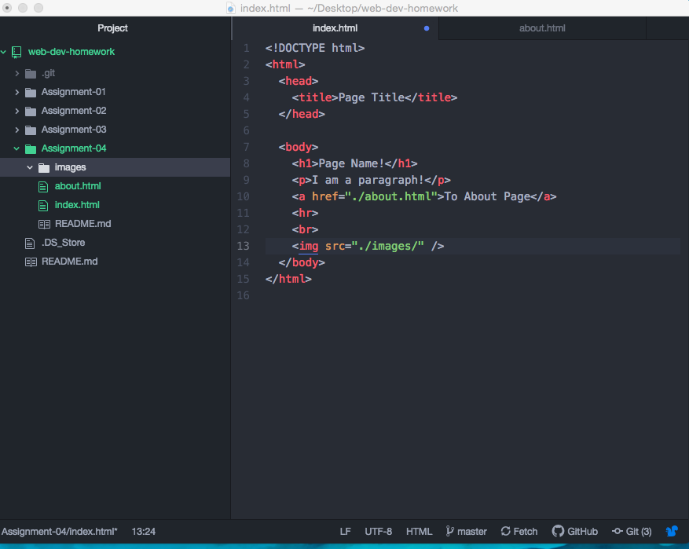

The website I used for the "The Wayback Machine" was yahoo.com. When I looked at a screenshot from 2008, the logo appeared different. In 2008 the logo was red and now it changed to pink. I also noticed that the individual pages were in rows going down the page (not spaced out) instead of columns going across the page in 2008. In 2020, the pages are divided in columns going across the page and are more spaced out.

I learned how to use programming language/other commands (html) to create or adding links, pictures, and other editing futures in Git-Hub & Atom. At first, dragging the documents into Git-hub was difficult but it became easier when I used Git-hub Desktop. Some of the files were not showing up since they didn't have anything in it (no data). The part was easy was creating the files and adding the necessary information into them. Also, the follow-along video and the links & steps added to the website link of Moodle were helpful too.

