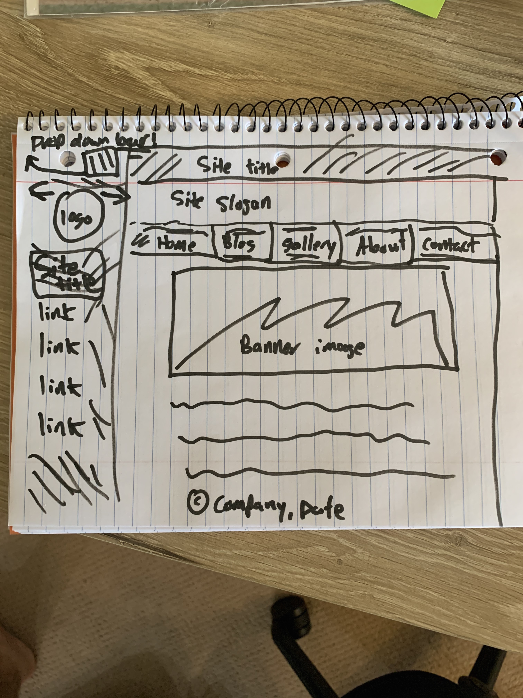

Padding is the amount of space between the inner content of an element and the element itself. Margin is the space between the box/element and other elements (outer space of an element). A border is either a solid line, dashed line, or double line that is around an element. The border is different from margin & padding because the border portion of the box can be separately colored, and has more style options.

In this assignment, I first started by sketching a simple layout that includes a site naviation, site, logo, site, title, and page content. Next, I added the 4 main document elements & 4 meta elements to my index.html. After that I created a link element inside my head element and added a style.css spreadsheet. Then I created my sketch layout using divs, classes and/or ids. In my style.css, I set the size of an element, border of an element, padding of an element, & the margin of an element. Then I changed the position of an element and the float of an element. Lastly, I styled one element with a hover pseduo-class to add interactivity to the layout.
